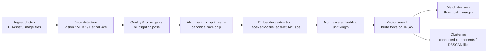
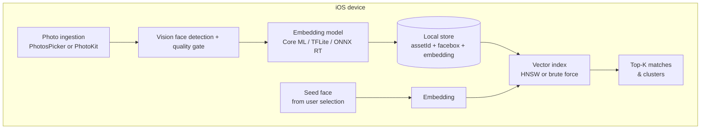

# Efficient Face Matching on iOS Without Photos People Albums

## Executive summary

The Photos app’s “People” feature behaves like an album in the UI, but it is not exposed to third‑party apps as a public, enumerable “person album” API surface in PhotoKit. Developers continue to ask whether PhotoKit provides access to People/Places groupings, and public guidance historically notes there is no supported way to access People-generated groupings as albums. citeturn9search4turn9search6turn9search0

The practical, implementable workaround is to build your own pipeline: **face detection → optional quality filtering → alignment/cropping → embedding extraction → fast nearest‑neighbor matching → clustering**. On iOS, the most commonly used building blocks are **Vision** (for detection/landmarks/quality) plus a **face-embedding model** executed via Core ML (or via ONNX Runtime / TensorFlow Lite), and then a **vector search index** (brute-force with Accelerate for small N, or ANN like HNSW for large N). citeturn3search2turn1search1turn3search16turn6view2

From a performance standpoint (your key constraint), the biggest wins come from: **(a)** processing downscaled images for detection, **(b)** embedding only faces that pass quality/pose gates, **(c)** storing normalized embeddings once (don’t recompute), and **(d)** using an ANN index (HNSW) once the number of faces gets large. PhotoKit also gives you native caching patterns so you don’t keep decoding huge images while iterating many assets. citeturn13search3turn13search19turn6view2

On privacy: **fully on-device** matching is feasible today and avoids sending biometric data off device; **server-assisted** approaches (e.g., Rekognition, Azure Face) simplify scaling and can deliver strong results, but add latency, cost, compliance obligations, and Apple review considerations depending on use case (notably if you’re doing account authentication). citeturn8search7turn8search4turn8search1

Unspecified constraints you may still need to decide (because the optimal design depends on them): whether you must support offline-only use, typical photo counts (1k vs 100k+ faces), whether you index the entire library or only a user-picked subset, the acceptable model size/binary size, and whether “good enough” means *verification* (same/not-same) or *clustering* (group all photos by person). citeturn9search4turn13search31

## Why People albums aren’t accessible and what that implies

As of early 2026, public PhotoKit collection subtypes include things like user library, favorites, selfies, etc., and also include a legacy “synced faces” concept (`albumSyncedFaces`) described as an album synced from iPhoto, not a modern People grouping. citeturn9search0turn9search2turn9search7

A long-standing developer answer states there is **no API for accessing albums created by the People feature** (and contrasts this with the older synced Faces album). While that answer is older, it aligns with current developer forum questions still asking for People/Places access—suggesting no new first-class API has appeared. citeturn9search6turn9search4

For implementation, this means: even if users can navigate to “People” inside Apple’s own Photos UI, your app should assume it will receive **assets (photos)**, not a “person” object or system-managed person cluster. Therefore, the most reliable UX is “pick a seed photo/face → app finds more.” citeturn9search4turn3search2

This report focuses on doing that efficiently—especially when you must process “many” photos.

## Face matching pipeline techniques that work in real iOS apps

A developer-focused face matching system on iOS almost always looks like the following (you can implement every stage today):



### Detection and face metadata on iOS (Vision)

**Detection.** Vision exposes `VNDetectFaceRectanglesRequest` to find faces in an image and return `VNFaceObservation` results. citeturn3search2

**Landmarks.** `VNDetectFaceLandmarksRequest` can detect facial landmarks, and its description indicates it locates faces and analyzes each face to detect features. Landmarks support alignment (rotating/scaling the face crop into a canonical frame). citeturn1search1turn1search10

**Quality.** Vision includes face capture quality support: `VNDetectFaceCaptureQualityRequest` updates `VNFaceObservation.faceCaptureQuality` with a value from 0 to 1, where higher is better. This is directly useful to skip low-quality faces early (motion blur, poor lighting, off-center). citeturn3search16turn3search0turn3search24

**Pose.** `VNFaceObservation` exposes yaw (and in newer revisions, pitch/roll) as optional values, which can be used to filter out profiles or extreme head pose before embedding (which improves accuracy and reduces wasted compute). citeturn3search1turn3search17turn3search2

### Alignment and preprocessing

Community implementations broadly agree that alignment matters: face recognition pipelines commonly include **detect → align → represent/embed → verify**. citeturn14search19turn6view3

Practical alignment approaches that work on iOS:

* **Vision-landmark-based affine alignment:** use eye/nose landmarks from `VNFaceLandmarks2D` regions, compute an affine transform so eyes land at standard coordinates, then crop/resize to the embedding model’s input size. citeturn1search1turn14search19turn6view3  
* **dlib/OpenCV alignment:** several iOS demo projects wrap dlib landmark models and combine them with OpenCV for alignment. citeturn6view4turn6view3turn4search2

For performance, you typically:
* detect faces on a **smaller image** (e.g., 480–720 px long edge),
* then crop the original (or a moderately sized version) only for the face region,
* then resize to the embedding input (commonly 112×112, 160×160, etc.). citeturn7search3turn13search31turn13search3

### Embeddings and similarity

Most real-world systems do not compare raw landmark distances; they compare **embedding vectors** produced by a face recognition model (FaceNet/MobileFaceNet/ArcFace-derived). Repos and tutorials frequently describe FaceNet-style embeddings being compared via Euclidean or cosine distance. citeturn6view0turn5search15turn7search20turn8search0

**Cosine similarity** is commonly used when embeddings are L2‑normalized; many ArcFace/InsightFace-based systems use cosine similarity and a configurable threshold. citeturn7search2turn7search33

### Efficient matching and clustering strategies

When you have “many” photos, your bottleneck is usually not just embedding inference; it’s also **searching** through potentially tens of thousands of embeddings.

Practical approaches used in production-like systems:

* **Two-stage match:**  
  1) ANN search for K nearest neighbors,  
  2) re-rank neighbors with exact cosine/L2 and apply a threshold + “margin” rule (best match must beat second-best by X).  
  This reduces false positives and keeps query time small. citeturn6view2turn5search6

* **Incremental clustering via graph connectivity:**  
  Build edges between embeddings with similarity above threshold, then compute connected components (Union-Find). This is easy to update when new faces are added: get K nearest neighbors, add edges above threshold, union sets. (This is a common engineering pattern for identity clustering on top of embeddings.) citeturn7search20turn7search19turn6view2

## Implementable libraries and approaches people actually use

image_group{"layout":"carousel","aspect_ratio":"16:9","query":["ArcFace face recognition embedding diagram","FaceNet 128 dimensional embedding visualization","iOS Vision face landmarks VNDetectFaceLandmarksRequest example","HNSW approximate nearest neighbor graph visualization"],"num_per_query":1}

The ecosystem usually breaks into “native iOS APIs,” “open-source on-device models/runtimes,” and “server APIs.”

### Native-first options (fast to ship, limited ceiling)

**Vision “feature prints” as a baseline (not face-specialized).** Apple provides `VNGenerateImageFeaturePrintRequest` + `VNFeaturePrintObservation.computeDistance` for image similarity. Developers use this for nearest-neighbor style similarity and duplicate detection. It’s not a face-ID model, but you *can* run it on face crops as a “v0” before integrating a dedicated face embedding model. citeturn1search6turn0search4turn0search13

Important practical gotcha: community notes that feature print vector dimensionality and distance scale changed between iOS 16 and iOS 17 (and that you can choose older behavior via the request revision). This matters because your threshold values will otherwise drift across OS versions. citeturn1search3turn1search2

### Open-source on-device embeddings (common in GitHub demos)

**FaceNet via Core ML.** Multiple iOS projects demonstrate real-time FaceNet-style recognition using Core ML, typically producing embeddings and then classifying/matching them (sometimes using SVM). One repo explicitly notes performance issues (“bounding box switching is slow”) on older hardware, which is a useful reminder that model + device choice matters. citeturn6view0turn5search15

**MobileFaceNet via TensorFlow Lite.** There are iOS repos bundling MobileFaceNet with TFLite (and sometimes MTCNN for detection and anti-spoofing). This pattern is common when teams already use TFLite across platforms. citeturn6view1turn17search6turn17search0

**ArcFace / InsightFace family via ONNX Runtime or converted models.** Many teams want ArcFace-like embeddings for accuracy. In practice on iOS, a common approach is running ONNX models with ONNX Runtime and using its CoreML Execution Provider on Apple platforms. citeturn5search5turn14search7

Licensing caveat (significant, and often overlooked): the InsightFace repo states its code is MIT, *but* also states that its training data and models are available for non-commercial research purposes only, and it includes 2025 updates indicating licensing channels for “open-sourced face recognition models (e.g., buffalo_l package).” If you’re shipping a commercial app, you must audit this carefully. citeturn18view0turn4search32

### “Classic” CV stacks on iOS (works, but heavier integration)

Several iOS demos still use **dlib + OpenCV** for landmarks/alignment and recognition (often with dlib’s face recognition ResNet model). These approaches are implementable but tend to increase build complexity (C++ toolchains, large model files, etc.). citeturn6view4turn6view3turn16search0turn16search5

dlib is permissively licensed under the Boost Software License (good for commercial use), and OpenCV is Apache 2.0. citeturn16search0turn16search1

### Commercial SDKs and hybrid libraries (pragmatic if they fit your constraints)

There are vendor-maintained iOS libraries (some with public repos) that provide face detection and recognition APIs and recommend specific detectors (e.g., RetinaFace) for accuracy/performance. For example, one Face Capture library recommends RetinaFace “for best performance and accurate face angle estimates.” citeturn11view2turn11view1

Some recognition libraries in this space may require an API key / backend access even if the code is public, so they are “hybrid by default.” citeturn11view0turn11view3

### Cloud APIs (server-only matching)

If you can send images (or embeddings) to a server, cloud services support face matching and similarity thresholds:

* Rekognition `CompareFaces` supports a similarity threshold parameter and documents default behaviors (e.g., default threshold behavior in responses). citeturn8search4turn8search8  
* Azure Face “Face Algorithm APIs” cover detection, find similar, verification, identification, and grouping (cloud-side clustering). citeturn8search1turn8search29  
* Google Cloud Vision explicitly documents that it does **face detection** but not specific individual face recognition. citeturn8search2turn8search14

Apple review consideration: Apple’s guidelines include a specific rule that apps using facial recognition for account authentication must use LocalAuthentication where possible and provide alternatives for users under 13. If your feature is *not* account authentication (e.g., “find photos of this person”), this rule may not directly apply, but it’s still relevant if your product scope drifts. citeturn8search7

### Comparison table of candidate solutions

The typical “right” choice depends on your constraints; below is an implementability-first comparison (qualitative where repos/docs don’t publish hard benchmarks).

| Approach | Accuracy ceiling | Latency at scale | Memory / binary cost | Privacy posture | Implementation effort | License & noteworthy caveats |
|---|---|---|---|---|---|---|
| Vision feature prints on face crops | Low–Medium (not face-ID specialized) citeturn1search6turn0search13 | Medium (brute force unless indexed; OS-version threshold drift) citeturn1search3turn1search2 | Low | On-device | Low | OS-version differences; you must fix revision/thresholds citeturn1search3turn1search2 |
| FaceNet embedding via Core ML (open-source demo pattern) | Medium–High (model dependent) citeturn6view0turn7search1 | Good if indexed; can be slow on older devices citeturn6view0 | Medium | On-device | Medium | Demo repo is Apache-2.0; model licensing varies by weights citeturn6view0 |
| MobileFaceNet via TFLite (with MTCNN / similar) | Medium–High (model dependent) citeturn6view1 | Good; designed for mobile; index recommended | Medium | On-device | Medium–High (TFLite plumbing) citeturn17search6 | TensorFlow is Apache-2.0; model weights licensing varies citeturn17search0turn6view1 |
| ONNX Runtime + ArcFace-style embeddings | High (model dependent) citeturn7search2turn8search0 | Good with ANN; can be excellent if CoreML EP works for your model citeturn5search5turn14search7 | Medium–High | On-device | High (conversion + ops + debugging) | ONNX Runtime is MIT citeturn16search3; InsightFace models may have non-commercial / licensing requirements citeturn18view0 |
| dlib recognition + OpenCV alignment on iOS | Medium (older gen; still usable) citeturn6view4turn6view3 | Medium (often CPU-bound) | High | On-device | High (C++ build, model files) | dlib is Boost Software License citeturn16search0; OpenCV is Apache-2.0 citeturn16search1 |
| Local ANN index via HNSW (for embeddings) | N/A (search layer; accuracy depends on embedding) | High (fast queries) citeturn6view2turn5search6 | Medium (index memory) | On-device | Medium | hnswlib.swift is MIT citeturn6view2; ObjectBox implements HNSW-style vector search citeturn5search6turn5search30 |
| Server-only face compare (Rekognition / Azure Face) | High (service dependent) citeturn8search4turn8search1 | Good at scale, but network adds latency | Low on device | Off-device biometric flow | Medium (API + infra + compliance) | Requires sending images/biometrics; Apple review constraints may apply by use case citeturn8search7turn8search4turn8search1 |

Primary sources referenced for the table are the platform docs and repos cited in-line (Vision/PhotoKit, TFLite, ONNX Runtime, InsightFace, dlib/OpenCV, HNSW libraries, and cloud provider docs). citeturn3search2turn1search1turn3search16turn17search0turn16search3turn18view0turn16search0turn16search1turn6view2turn8search4turn8search1

## Performance-focused architectures and data pipelines for “many” photos

When you say “we have to go over many,” the system design should assume the following scaling pressures:

* **N can explode**: one photo can contain multiple faces; 10k photos can easily become 20k–60k face crops. citeturn3search2turn9search4  
* **Decoding is expensive**: repeatedly requesting full-size images will dominate runtime unless you use caching/downscaled requests. citeturn13search31turn13search3turn13search19  
* **Search must be sublinear** once N is large: brute-force cosine across 100k × 512-d embeddings per query quickly becomes noticeable on-device. (Hence ANN/HNSW tools show up in practice.) citeturn6view2turn5search6  

### Architecture patterns

**On-device-only (recommended for privacy + offline).**



This avoids uploading faces and is implementable with built-in APIs plus on-device model inference. citeturn3search2turn3search16turn13search3turn6view2

**Server-only (simpler scaling, harder privacy).**


This is often fastest to implement when you already operate backend infrastructure, but it introduces legal/compliance and networking constraints for biometric data. citeturn8search4turn8search1turn8search7

**Hybrid (common compromise).** The most pragmatic hybrid is: **compute embeddings on-device**, upload **only embeddings** (not images) for cross-device search / multi-device sync. But you still must treat embeddings as biometric in many jurisdictions; and you must ensure your model/embedding cannot be trivially inverted (generally difficult but not impossible to misuse). (This is an inference; the compliance burden depends on your jurisdiction and threat model.) citeturn8search7turn8search23

### Data pipeline for indexing at scale

A practical indexing pipeline for PhotoKit-based library access:

1. **Enumerate assets efficiently** and request appropriately sized images. Apple provides a caching image manager intended for performance when working with many assets. citeturn13search3turn13search31turn13search19  
2. **Detect faces on downscaled frames**, optionally using `regionOfInterest` if you already know the part of the image you care about (e.g., re-processing a cropped region). citeturn13search0turn3search2  
3. **Gate by quality/pose early** (captureQuality + yaw/pitch thresholds), and skip tiny faces (<100×100 px) because detectors (including ML Kit guidance for minimum face size) degrade below that. citeturn3search16turn3search0turn7search3  
4. **Compute embeddings once per detected face**, normalize them, and persist: `(assetLocalIdentifier, faceRectNormalized, embeddingVector, quality, timestamp)`; do not recompute unless the asset changes. citeturn7search20turn6view0turn15search9  
5. **Build/update an ANN index** and store it on disk; some Swift HNSW bindings support saving/loading indices and deletion of elements, which matters when photo libraries change. citeturn6view2turn15search9

For incremental updates (critical to avoid rescanning everything):

* **Listen for live changes** using `PHPhotoLibraryChangeObserver`. citeturn3search3  
* **Use persistent change history** (WWDC22 change history API) so you can resume indexing after the app wasn’t running, by storing a persistent change token and fetching changes since that token. Apple provides `PHPhotoLibrary.fetchPersistentChanges(since:)` and documents persisting tokens across launches. citeturn15search9turn15search2turn15search12

### Performance knobs that matter on iOS

**Vision request scheduling and resource usage.** `VNRequest.preferBackgroundProcessing` explicitly trades slower execution for reduced contention/memory footprint—useful when you’re scanning in the background but don’t want to jank the UI. citeturn15search0

**CPU vs GPU / compute devices.** Vision requests historically could be forced to CPU (`usesCPUOnly`), and newer OSes expose supported compute devices per stage plus APIs to assign them. If you run into simulator/device differences or need to control compute placement, this is the direction Apple has documented. citeturn12search0turn12search1turn12search8

**Photo decoding/caching.** `PHCachingImageManager` exists specifically to “prepare asset images in the background” for quick reuse (which is what you need when scanning many assets). Apple also documented “preheating” patterns for smooth scrolling and bulk thumbnail work (a concept that generalizes well to ML preprocessing). citeturn13search3turn13search19

**Index choice at different N.**
* If you only ever have a few thousand faces, brute force with normalized dot products can be fine (especially if you batch in Accelerate).  
* Once you get into tens of thousands+, HNSW-style indexes become compelling; Swift bindings and on-device vector DB offerings explicitly target this use case. citeturn6view2turn5search6turn5search30

## Practical code patterns for an efficient iOS implementation

The snippets below show “how people actually wire it up” (Vision + embedding + vector search). They are intentionally minimal and leave model selection abstract.

### Vision face detection + quality + landmarks (call pattern)

```swift
import Vision
import UIKit

struct DetectedFace {
    let observation: VNFaceObservation
    let captureQuality: Float?
}

func detectFaces(in cgImage: CGImage) async throws -> [DetectedFace] {
    let detectFaces = VNDetectFaceRectanglesRequest()
    let detectQuality = VNDetectFaceCaptureQualityRequest()
    let detectLandmarks = VNDetectFaceLandmarksRequest()

    // You generally do: detect faces first, then pass observations into the
    // quality / landmarks requests (or run landmarks directly if you prefer).
    let handler = VNImageRequestHandler(cgImage: cgImage, options: [:])
    try handler.perform([detectFaces])

    let faces = (detectFaces.results as? [VNFaceObservation]) ?? []
    if faces.isEmpty { return [] }

    // Attach observations to downstream requests
    detectQuality.inputFaceObservations = faces
    detectLandmarks.inputFaceObservations = faces

    // Consider preferBackgroundProcessing during bulk scans
    detectQuality.preferBackgroundProcessing = true
    detectLandmarks.preferBackgroundProcessing = true

    try handler.perform([detectQuality, detectLandmarks])

    let qualityFaces = (detectQuality.results as? [VNFaceObservation]) ?? []
    // qualityFaces[i].faceCaptureQuality is now populated when available

    return qualityFaces.map { DetectedFace(observation: $0, captureQuality: $0.faceCaptureQuality?.floatValue) }
}
```

The APIs referenced above are documented by Apple: face rectangles, landmarks, capture quality, and the `faceCaptureQuality` property. citeturn3search2turn1search1turn3search16turn3search0

### Embedding extraction with Core ML (pattern)

Most Core ML embedding models are executed either directly through `MLModel` or via `VNCoreMLRequest` when you want Vision to manage preprocessing. Here’s a Vision-driven approach:

```swift
import CoreML
import Vision

final class FaceEmbedder {
    private let model: VNCoreMLModel

    init(mlModel: MLModel) throws {
        self.model = try VNCoreMLModel(for: mlModel)
    }

    func embedding(from faceChip: CGImage) async throws -> [Float] {
        let request = VNCoreMLRequest(model: model)
        request.imageCropAndScaleOption = .scaleFill

        let handler = VNImageRequestHandler(cgImage: faceChip, options: [:])
        try handler.perform([request])

        // Parse output depending on your model's output type/name.
        // Common: VNCoreMLFeatureValueObservation -> MLMultiArray -> [Float]
        guard
            let obs = request.results?.first as? VNCoreMLFeatureValueObservation,
            let arr = obs.featureValue.multiArrayValue
        else { return [] }

        return (0..<arr.count).map { Float(truncating: arr[$0]) }
    }
}
```

Apple documents `VNCoreMLRequest` as the Vision request for using Core ML models, and also documents running multiple requests together via an image request handler for optimal performance in Swift Vision workflows. citeturn12search3turn13search2turn13search37

### Fast nearest-neighbor search with HNSW on-device

For large N, Swift bindings for HNSW are directly usable and support L2/cosine metrics, multithreaded build/query, and saving/loading indices:

```swift
import hnswlib_swift

final class FaceIndex {
    let dim: Int
    let index: HNSWIndex

    init(dim: Int, maxElements: Int) throws {
        self.dim = dim
        self.index = try HNSWIndex(spaceType: .cosine, dim: dim)
        try index.initIndex(maxElements: maxElements, m: 16, efConstruction: 200, randomSeed: 42)
    }

    func add(id: Int, vector: [Float]) throws {
        try index.addPoint(id: id, vector: vector)
    }

    func query(vector: [Float], k: Int) throws -> [(id: Int, distance: Float)] {
        let result = try index.searchKnn(query: vector, k: k)
        return result.map { ($0.id, $0.distance) }
    }
}
```

This is grounded in the library’s stated features and usage examples. citeturn6view2

## Recommended v1 implementation plan and checklist

This plan assumes: iOS app context, “many” photos/faces, and a need for a responsive UX. Where you have missing constraints, the checklist calls them out.

### Recommended v1 plan

**Define a concrete scope for indexing.** If you don’t need entire-library search, start by indexing only what the user selects (fewer permissions, fewer assets). If you do need entire-library indexing, plan for background processing and incremental PhotoKit change handling. citeturn9search4turn15search9

**Use Vision for detection + quality gating.**  
Implement `VNDetectFaceRectanglesRequest`, then `VNDetectFaceCaptureQualityRequest`. Only proceed to landmarks/alignment/embedding when `faceCaptureQuality` is above a tuned threshold (e.g., 0.4–0.6) and head pose isn’t extreme. This reduces wasted embedding inference. citeturn3search2turn3search16turn3search0

**Pick an embedding model with clear licensing.**  
For a quick v1 that is widely copied in apps, FaceNet-style Core ML demos exist; MobileFaceNet TFLite iOS repos exist; ArcFace-style solutions exist but licensing for popular weight packs needs careful review. Start with the most license-clear path you can defend. citeturn6view0turn6view1turn18view0turn17search0

**Normalize embeddings and standardize distance metrics.**  
Decide early: cosine similarity on normalized vectors vs L2. Keep it consistent across your index and thresholds. Many ArcFace-style systems use cosine similarity with a configurable threshold. citeturn7search2turn7search33

**Make search scale with N.**  
* For N ≤ ~5k: start with brute-force dot products (simplicity).  
* For N ≥ ~20k: integrate HNSW (or an on-device vector DB) so queries stay fast as the user’s library grows. citeturn6view2turn5search6turn5search30

**Implement incremental updates from day one.**  
Store per-face records keyed by `PHAsset.localIdentifier` + face rectangle + a “processed version.” Implement at least the live observer, and preferably persistent history so you avoid full rescans. citeturn3search3turn15search2turn15search9

**Design the UX around “seed face → find matches.”**  
This directly replaces People albums: the user picks one or two photos of the person; you embed the face; run a nearest-neighbor search; show top matches; allow the user to correct mistakes; optionally feed corrections into clustering (merge/split). This aligns with the practical reality that People albums aren’t available as a public API. citeturn9search6turn9search4

### V1 checklist

**Permissions & data access**
- Decide: user-selected assets only vs full Photo Library access (permission + UX impact). citeturn15search21turn9search4
- Confirm you are not relying on any People album enumeration (not supported). citeturn9search6turn9search4

**Performance**
- Use `PHCachingImageManager` for bulk scanning and thumbnails; avoid full-resolution requests when not needed. citeturn13search3turn13search31
- Gate by `faceCaptureQuality` and pose before embedding. citeturn3search16turn3search0
- Use `preferBackgroundProcessing` during background indexing to reduce contention. citeturn15search0
- Plan for ANN (HNSW) if N is large. citeturn6view2turn5search6

**Model & licensing**
- Document the license of your runtime (Core ML, ONNX Runtime MIT, TensorFlow Apache, etc.) and—more importantly—the license of the **model weights** you ship. citeturn16search3turn17search0turn18view0
- If using InsightFace-derived weights, verify commercial rights (their repo explicitly calls out model licensing constraints). citeturn18view0

**Quality & accuracy**
- Maintain a small internal evaluation set and tune thresholds per model/device.
- Add a “margin” rule to reduce false positives (best match must beat runner-up by X). (Engineering recommendation; validate on your data.) citeturn7search2turn6view2

**Ongoing library changes**
- Implement `PHPhotoLibraryChangeObserver` for live updates. citeturn3search3
- Persist `PHPersistentChangeToken` and process `fetchPersistentChanges(since:)` on launch/resume to avoid full rescans. citeturn15search2turn15search12

**Privacy & App Review risk**
- If the feature ever becomes account authentication, ensure you meet Apple’s guideline that facial recognition authentication should use LocalAuthentication where possible and provide an alternate method for users under 13. citeturn8search7
- If you add server matching, be explicit about biometric data handling and user consent flows. citeturn8search23turn8search4turn8search1